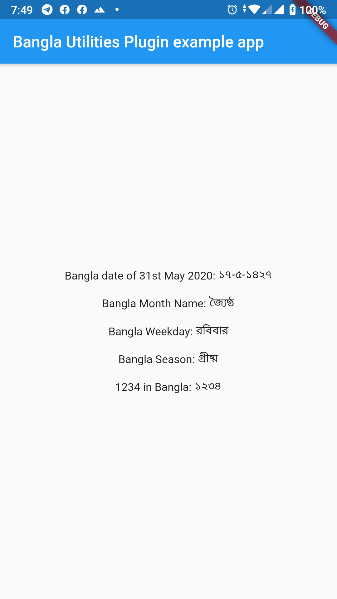

# bangla_utilities

This plugin provides all necessary functionality to get weekday, day, month, monthName, year and season from current date or from a provided date. It also provides leap-year checker and English to Bangla number converter as well.
All APIs are provided as static-method of the BanglaUtility class.

## Getting Started

* Install by adding the package to your pubspec.yaml under dependency.

* Import

* `var date = BanglaUtility.getBanglaDate(day: day, month: month, year: year)`

